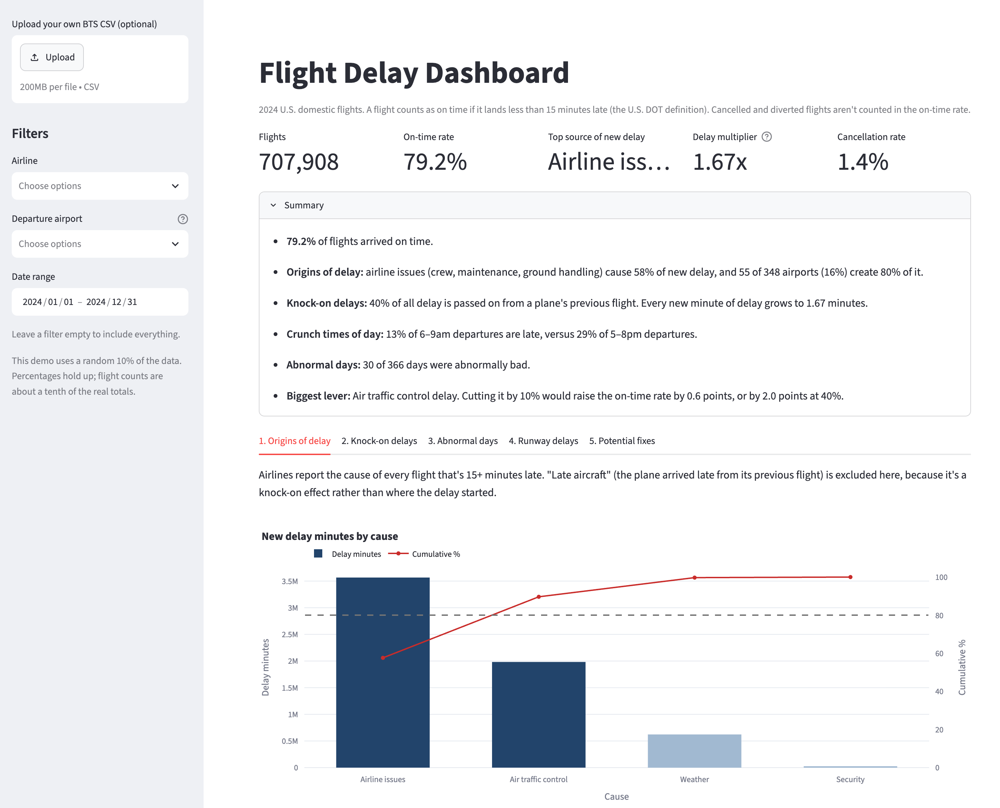

# Flight Delay Dashboard

A dashboard that analyses 2024 domestic flight delays in the United States. Examines reasons for delay and how it builds up through the day. Also analyses the impact of potential fixes.

**[Live demo](https://flight-delays-dashboard.streamlit.app)** · Built with Python, Pandas, Plotly and Streamlit on official US flight data (BTS).



## Summary

**Based on 7,079,081 U.S. domestic flights from January 1 to December 31, 2024.**

* **79.2%** of flights arrived on time. A flight counts as on time if it lands less than 15 minutes late (the U.S. DOT definition).
* **Origins of delays:** airline issues (crew, maintenance, ground handling) cause 58% of new delay, and just 56 of 348 airports (16%) create 80% of it.
* **Knock-on delays:** 40% of all delay is passed on from a plane's previous flight. Every new minute of delay grows to 1.68 minutes by the end of the day.
* **Crunch times of day:** 13% of 6–9am departures are late, versus 29% of 5–8pm departures.
* **Abnormal days:** 32 of 366 days were abnormally bad, including the CrowdStrike IT outage and January's arctic blast.
* **Biggest levers:** air traffic control delay. Cutting it by 10% would raise the on-time rate by 0.6 points, or by 2.0 points at 40%. However, considering only factors fully within an airline's control, the biggest lever is faster, standardized turnarounds.

## Findings

### 1. Origins of delay

Airlines report the cause of every flight that is 15+ minutes late. Note that "Late aircraft" (where the plane arrived late from its previous flight) is excluded as it represents a knock-on effect rather than the origin of delay.

| Cause                     | New delay minutes | % of total | Cumulative % |
| ------------------------- | ----------------: | ---------: | -----------: |
| Airline issues            |        35,823,264 |      57.9% |        57.9% |
| Air traffic control       |        19,621,994 |      31.7% |        89.7% |
| Weather                   |         6,195,873 |      10.0% |        99.7% |
| Security                  |           179,928 |       0.3% |       100.0% |

**56 of 348 airports (16%) create 80% of new delay minutes.** The top 10:

| Rank | Airport | New delay minutes | % of total | Cumulative % |
| ---- | ------- | ----------------: | ---------: | -----------: |
| 1    | DFW     |         3,227,593 |       5.2% |         5.2% |
| 2    | ATL     |         3,049,109 |       4.9% |        10.2% |
| 3    | ORD     |         2,842,408 |       4.6% |        14.8% |
| 4    | DEN     |         2,499,756 |       4.0% |        18.8% |
| 5    | CLT     |         2,186,256 |       3.5% |        22.3% |
| 6    | MCO     |         1,596,490 |       2.6% |        24.9% |
| 7    | LAX     |         1,477,635 |       2.4% |        27.3% |
| 8    | LAS     |         1,433,019 |       2.3% |        29.6% |
| 9    | DTW     |         1,419,591 |       2.3% |        31.9% |
| 10   | LGA     |         1,358,572 |       2.2% |        34.1% |

### 2. Knock-on delays

When a plane is late, its next flight usually is too. To measure this, I divide all delay by the new delay:

> **Total delay minutes ÷ new delay minutes = 1.68x**

In other words, every minute of delay that starts somewhere turns into 1.68 minutes in total, as the same plane runs late on later flights.

Knock-on delays vary significantly by airline. The three highest and three lowest:

| Airline                   | Delay multiplier | Share of delay passed on |
| ------------------------- | ---------------: | -----------------------: |
| Frontier (F9)             |            2.19x |                      54% |
| Southwest (WN)            |            2.07x |                      52% |
| PSA / American Eagle (OH) |            1.98x |                      50% |
| Delta (DL)                |            1.41x |                      29% |
| Spirit (NK)               |            1.39x |                      28% |
| SkyWest (OO)              |            1.23x |                      19% |

Furthermore, knock-on delays build up through the day, growing from about 1 minute per flight at 6am to about 11 minutes by 7pm, and the share of late flights rises from around 10% in the early morning to about 30% by 7–8pm.

### 3. Abnormal days

**32 of 366 days** were identified to have abnormally high levels of delay (as compared to the average day with 20.8% of flights late). Various 'catastrophic' events explain some of these:

| Date         | Flights late | Relevant event |
| ------------ | -----------: | ------------- |
| Jul 19, 2024 |          58% | CrowdStrike IT outage: a faulty software update crashed Windows systems and grounded several major airlines |
| Jan 16, 2024 |          51% | Arctic blast and winter storm reaching the Northeast |
| Jan 15, 2024 |          50% | Arctic blast (MLK Day) with sub-zero temperatures across most of the U.S. |
| Jan 9, 2024  |          45% | Winter storm during the Boeing 737 MAX 9 grounding |
| Jul 22, 2024 |          45% | Delta still recovering from CrowdStrike after its crew-scheduling system failed |


### 4. Runway delays

The typical plane spends **15 minutes** between leaving the gate and taking off. Planes at JFK wait about 11 extra minutes, and at ORD about 9. DFW, CLT and LGA are also among the worst.

### 5. Potential fixes

This table shows how much the on-time rate would rise (in percentage points) if each cause of delay were to be cut by 10%, 20%, 30% or 40%.

| Fix                          | Owner                |   10% |   20% |   30% |   40% |
| ---------------------------- | -------------------- | ----: | ----: | ----: | ----: |
| Spread out departure peaks   | Network Planning     | +0.58 | +1.01 | +1.54 | +1.98 |
| Standardize turnaround tasks | Ground Operations    | +0.49 | +0.85 | +1.31 | +1.72 |
| Add buffer between flights   | Network Ops Control  | +0.36 | +0.65 | +1.03 | +1.41 |
| Bad-weather and de-icing plans | Ops Control Centre | +0.02 | +0.04 | +0.07 | +0.10 |
| Checkpoint staffing          | Airport Partnerships | +0.01 | +0.01 | +0.01 | +0.02 |

Air traffic control (ATC) delay ranks first, even though airline issues cause more delay. This is because ATC delays are more commonly the cause of delay on flights close to the 15-minute threshold, so minor improvements bring them below the delay threshold. However, as ATC factors are typically out of an airline's control, improving turnaround procedures on the ground such as cleaning and catering would be a more direct course of action for an airline.

## How it works

| Question | Method |
| -------- | ------ |
| Where does delay start? | Pareto chart (ranks causes and airports biggest-first) |
| How far does it spread? | Delay multiplier by airline and by hour of day |
| Which days were abnormal? | Control chart of the daily late rate (Laney p′, which adjusts for very large daily flight counts) |
| What would help most? | What-if: recount on-time flights after cutting each delay cause |

## Caveats

* Delay causes are only recorded for flights 15+ minutes late, and rely on airline self-reporting.
* The data does not follow individual planes from flight to flight, so the multiplier is a network-wide estimate.
* Airline differences may partly come from route networks and labelling practices.
* The live demo uses a random 10% of the full dataset.

## Run it locally

```bash
git clone https://github.com/YOUR-USERNAME/flight-delays-dashboard.git
cd flight-delays-dashboard
pip install -r requirements.txt
streamlit run app.py
```

To use the full dataset, download on-time data from [BTS TranStats](https://www.transtats.bts.gov/) and run `python prepare_data.py data/raw/YOUR_FILE.csv`.

## Files

```text
├── app.py                    # Streamlit dashboard
├── charts.py                 # Charts
├── opex_engine.py            # The analysis
├── data_loader.py            # Loads and cleans the data
├── prepare_data.py           # Shrinks the raw CSV (run once)
├── data/flights_sample.parquet
└── requirements.txt
```